  

   

  

    <strong>Full-stack product developer &amp; visual builder from Vietnam</strong> 
    I take ideas across the stack — from domain models and APIs to interfaces people enjoy using.
  

  

    

  
  &nbsp;
  
  &nbsp;
  

    

  
  

 

<table>
  <tr>
    <td width="31%" valign="middle" align="center">
      
       
      <em>“You too can become a hero.”</em>
    </td>
    <td width="69%" valign="middle">
      <h2>WHO AM I?</h2>
      

        Hey, I'm <strong>Viet Anh</strong> (<code>Ch1mpleo</code>) — a software developer and student at <strong>FPT University</strong> in Vietnam.
      

      

        I build products across <strong>C# / .NET</strong>, <strong>TypeScript / React</strong>, and mobile. I enjoy owning the whole path: shaping the domain, designing APIs and data flows, connecting external services, and turning it all into an interface that feels clear and intentional.
      

      

        My capstone, <strong>OboxSTEAM</strong>, is where I have invested the most care and effort. Building its API, web platform, and parent mobile app taught me how much thought it takes to make many roles, workflows, and technologies feel like one coherent product.
      

      

        Deku stays here because his journey reminds me that becoming capable is not about starting gifted — it is about choosing to improve, helping people, and getting back up every time.
      

    </td>
  </tr>
</table>

 

## FLAGSHIP PRODUCT

### [OBOXSTEAM](https://oboxsteam.website/)

**A Vietnamese experiential-learning platform that turns a student's STEAM journey into a portfolio they can carry forward.**

CAPSTONE PROJECT · FULL PRODUCT SYSTEM · API + WEB + MOBILE

 

OboxSTEAM connects **online learning, live and offline lab sessions, assessments, payments, media evidence, and student progress** in one platform. As students complete programs, the system transforms their certificates, tagged photos, projects, and highlight videos into public portfolio microsites designed to support future study-abroad applications.

What makes me proud is not only the amount of functionality, but the product thinking behind it: students, parents, mentors, managers, and admins each need a different view of the same learning journey. I worked across the system to keep those experiences connected rather than treating the API, frontend, and mobile app as separate assignments.

<table>
  <tr>
    <td width="33%" valign="top">
      
<strong><a href="https://github.com/OboxSTEAM/OboxSTEAM.API">API</a></strong> &nbsp; <code>[CORE]</code>

      
The domain and integration backbone.

      

        Clean Architecture backend modeling programs, modules, courses, activities, cohorts, enrollment, submissions, portfolios, payments, and AI-assisted media workflows.
      

      

        
        
        
        
        
      

    </td>
    <td width="33%" valign="top">
      
<strong><a href="https://github.com/OboxSTEAM/OboxSTEAM.FE">WEB</a></strong> &nbsp; <code>[EXPERIENCE]</code>

      
One platform, many learning journeys.

      

        Role-aware web product for discovery, enrollment, learning, mentoring, progress, and portfolio building — including public student microsites with path and subdomain routing.
      

      

        
        
        
        
        
      

    </td>
    <td width="33%" valign="top">
      
<strong><a href="https://github.com/OboxSTEAM/OboxSTEAM.Mobile">MOBILE</a></strong> &nbsp; <code>[PARENT]</code>

      
The learning journey, visible to parents.

      

        A dedicated parent experience sharing the same backend, with secure sessions and synchronized contracts for profiles, children, notifications, and learning progress.
      

      

        
        
        
        
      

    </td>
  </tr>
</table>

  <code>PROGRAM → MODULE → COURSE → ACTIVITY</code> 
  Learning progress becomes evidence · evidence becomes a portfolio · the portfolio tells the student's story.

 

## PERSONAL SHOWPIECE

<table>
  <tr>
    <td width="64%" valign="middle">
      <h3><a href="https://ch1mpleo.github.io/visual-portfolio/">VISUAL PORTFOLIO</a></h3>
      
<em>The project that looks and feels most like me.</em>

      

        This is not meant to be a formal portfolio template. It is my corner of the internet where developer mode and gamer mode share a save file — a place for expressive layouts, smooth movement, playful transitions, and references that reward a closer look.
      

      

        I am proud of it because it proves that frontend work can communicate personality, not only information. It is where I let art direction lead and use code to support the atmosphere.
      

      

        
        
      

    </td>
    <td width="36%" valign="middle">
      
<code>BUILT WITH //</code>

      

        
        
        
        
      

      
<code>DESIGN NOTES //</code>

      
Dark, kinetic, game-aware, experimental, and intentionally personal.

    </td>
  </tr>
</table>

  
<strong>MORE RECENT EXPERIMENTS</strong>

   
  <ul>
    <li><a href="https://github.com/Ch1mpleo/GraphPaper"><strong>GraphPaper</strong></a> — a .NET GraphRAG system that turns research papers into navigable knowledge graphs.</li>
    <li><a href="https://ch1mpleo.github.io/MLN131-Visual/"><strong>MLN131 Visual</strong></a> — political theory redesigned as a constructivist interactive museum.</li>
    <li><a href="https://ch1mpleo.github.io/VNR-Visual/"><strong>VNR Visual</strong></a> — an archival, scroll-driven visual experience about Vietnam from 1945–1954.</li>
  </ul>

 

## LOADED MODULES

<table width="100%">
  <tr>
    <td width="19%" valign="middle"><strong>BACKEND</strong></td>
    <td width="81%" valign="middle">
      
      
      
      
      
    </td>
  </tr>
  <tr>
    <td width="19%" valign="middle"><strong>FRONTEND</strong></td>
    <td width="81%" valign="middle">
      
      
      
      
      
    </td>
  </tr>
  <tr>
    <td width="19%" valign="middle"><strong>PRODUCT DATA</strong></td>
    <td width="81%" valign="middle">
      
      
      
      
      
    </td>
  </tr>
  <tr>
    <td width="19%" valign="middle"><strong>MOBILE</strong></td>
    <td width="81%" valign="middle">
      
      
      
      
    </td>
  </tr>
  <tr>
    <td width="19%" valign="middle"><strong>CREATIVE + OPS</strong></td>
    <td width="81%" valign="middle">
      
      
      
      
      
    </td>
  </tr>
</table>

 

## AFTER HOURS

<table>
  <tr>
    <td width="50%" valign="top">
      
<code>GAMES //</code>

      

        I like games with weight, mystery, and worlds that do not explain everything. <strong>Soulsborne</strong> for the challenge and lore, <strong>ARC Raiders</strong> for its tense lived-in sci-fi, and <strong>Marathon</strong> for its fearless color, typography, and atmosphere.
      

    </td>
    <td width="50%" valign="top">
      
<code>VISUALS //</code>

      

        I gravitate toward strong art direction: archival brutalism, dark minimalism, unusual type, intentional motion, and interfaces that feel like artifacts from another world. That taste naturally leaks into what I build.
      

    </td>
  </tr>
</table>

 

## CONTRIBUTION LOG

The snake is still eating my commits.

<picture>
  <source media="(prefers-color-scheme: dark)" srcset="https://raw.githubusercontent.com/Ch1mpleo/Ch1mpleo/output/github-snake-dark.svg" />
  <source media="(prefers-color-scheme: light)" srcset="https://raw.githubusercontent.com/Ch1mpleo/Ch1mpleo/output/github-snake.svg" />
  
</picture>

 

  Built by <strong>Viet Anh</strong> — fueled by curiosity, late nights, and one more attempt.
    
  <a href="mailto:vietanh051203@gmail.com">Say hello</a>
  &nbsp;&middot;&nbsp;
  <a href="https://github.com/Ch1mpleo?tab=repositories">Explore my work</a>

